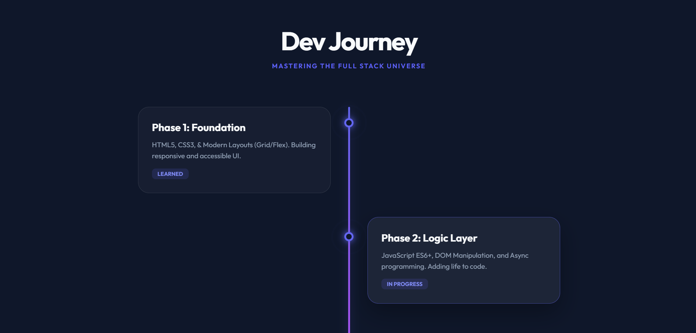
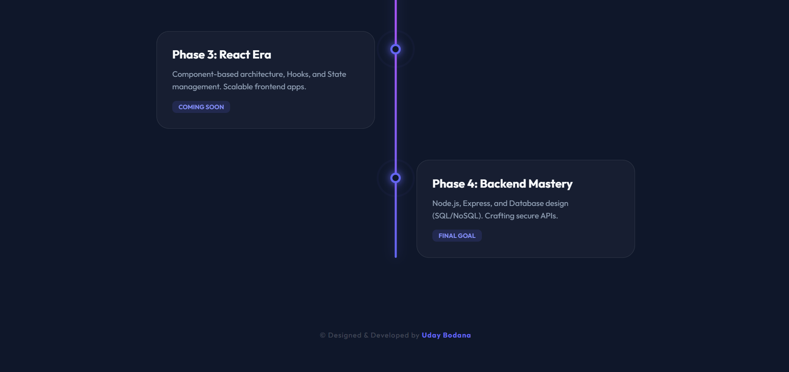

# 🛣️ Vertical Roadmap

A sleek and interactive vertical timeline design tailored to showcase step-by-step journeys or project paths. Features a glowing center track and beautifully animated milestones.

---

## ✨ Features

- **Glowing Milestone Center:** A glowing, color-gradient track running down the center for a highly modern look.
- **Alternating Timeline Cards:** Left and right content layout powered by pure CSS and Flexbox.
- **Pulsing Milestone Nodes:** Smooth keyframe pulse animations draw the user's focus down the path.
- **Fully Responsive Design:** Adapts smoothly to mobile screens by converting the layout to a continuous single-sided timeline.

---

## 🚀 How to Use

1. **Scroll Through Content:** Navigate down the page to read each sequential milestone.
2. **Observe Interactions:** Hover over roadmap cards to experience premium hover effects.

---

## 💻 Tech Stack

- **HTML5**
- **CSS3**

---

## 🏃 How to Run

1. Clone or download this repository.
2. Open `index.html` directly in any web browser, or use a local development server like **Live Server** in VS Code.

---

## 📸 Preview

---

© Designed & Developed by **Uday Bodana**